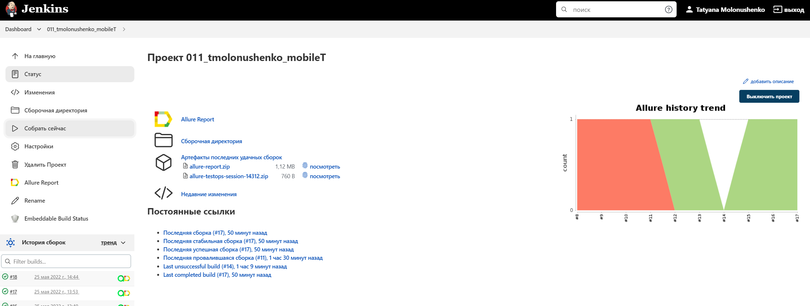
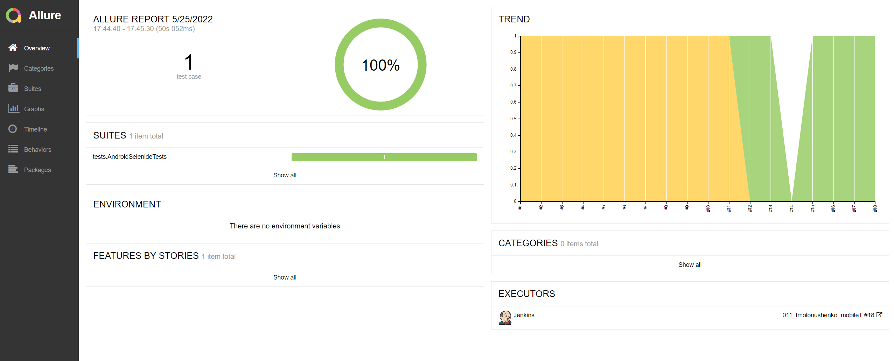
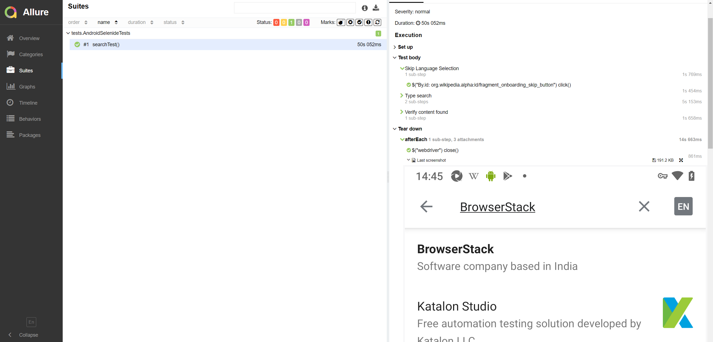
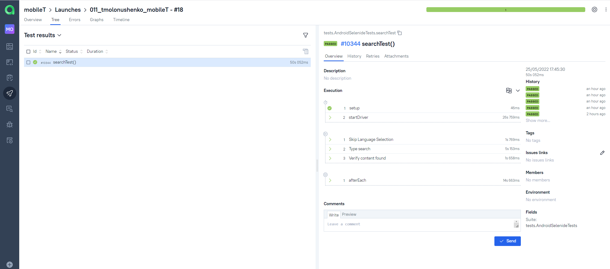
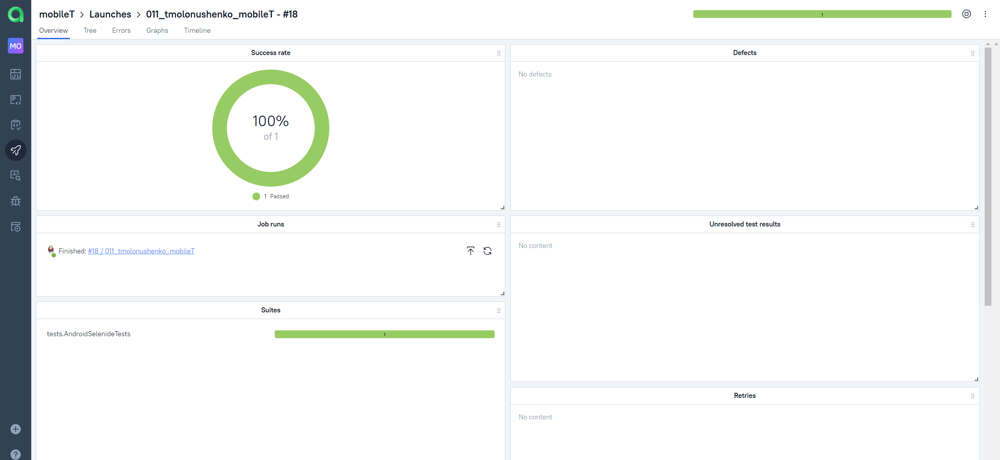

## Проект по автоматизации UI тестирования мобильного приложения Wikipedia

<a href="https://github.com/wikimedia/apps-android-wikipedia/releases/tag/latest">

### Технологии используемые в проекте

---

#### Список реализованных проверок
- [x] Поиск статей в приложении

##  Запуск тестов в [Jenkins](https://jenkins.autotests.cloud/job/011_tmolonushenko_mobileT/)

---

##  Отчет о результатах тестирования в [Allure Report](https://jenkins.autotests.cloud/job/011_tmolonushenko_mobileT/allure/)

----

### Список тестов c описанием 

###  Проект интегрирован с Allure TestOps

---

## Тест-кейсы с историей запусков

## Дашборд

---
##  Видео-отчет о прохождении теста:

